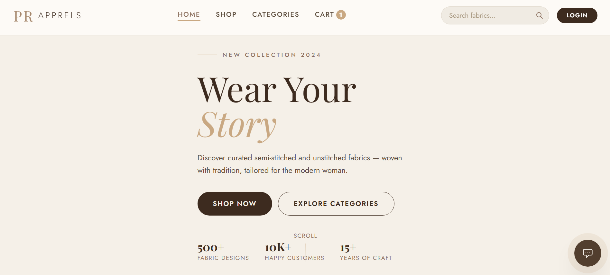
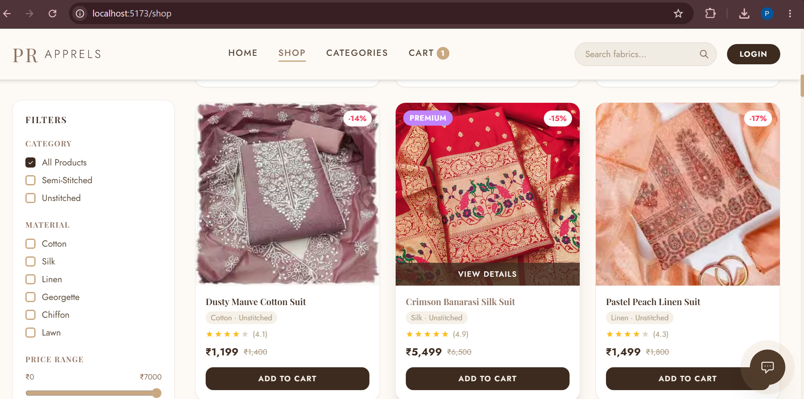
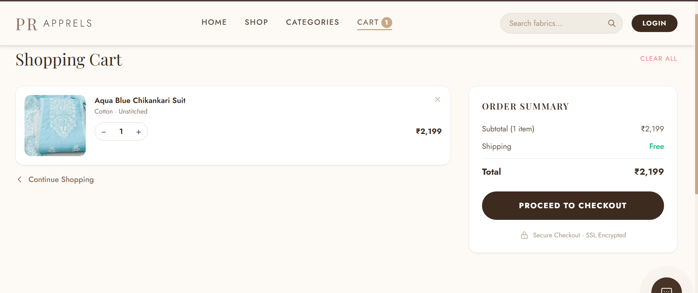

# PR Apparel 🛍️
# Full-Stack E-Commerce Clothing Platform

PR Apparel is a full-stack MERN e-commerce application built to provide a seamless online clothing shopping experience. The project demonstrates RESTful API development, JWT-based authentication, MongoDB integration, and responsive frontend development using React and Tailwind CSS.
---

## 🎯 Project Objective

The goal of this project was to gain hands-on experience in building a complete MERN stack application by implementing user authentication, product management, shopping cart functionality, and order processing while following a modular backend architecture.

---

- **Tech Stack:** React.js · Tailwind CSS · Node.js · Express.js · MongoDB

---

## ✨ Features

- 🔐 **User Authentication** — Register, login, and protected routes
- 🛒 **Shopping Cart** — Add, remove, and update item quantities
- 👗 **Product Catalog** — Browse all products with detailed product pages
- 🔍 **Category Filtering** — Filter products by clothing category
- 📦 **Order Management** — Place orders and track order history
- 📱 **Responsive Design** — Mobile-first UI built with Tailwind CSS
- 💬 **AI Chatbot** — Integrated chat assistant for user support

---

## 🛠️ Tech Stack

| Layer | Technology |
|-------|-----------|
| Frontend | React.js, Tailwind CSS, Vite |
| Backend | Node.js, Express.js |
| Database | MongoDB |
| Auth | JWT (JSON Web Tokens) |
| State Management | React Context API |
| Chatbot API | GROQ API KEY

---

## 📁 Project Structure

```
PR--Apparel/
├── pr-apprels/                 # Frontend (React)
│   ├── src/
│   │   ├── components/         # Reusable UI components
│   │   │   ├── Navbar.jsx
│   │   │   ├── Footer.jsx
│   │   │   ├── ProductCard.jsx
│   │   │   └── AIChatbot.jsx
│   │   ├── pages/              # Page-level components
│   │   │   ├── HomePage.jsx
│   │   │   ├── ShopPage.jsx
│   │   │   ├── ProductDetailPage.jsx
│   │   │   ├── CartPage.jsx
│   │   │   ├── CheckoutPage.jsx
│   │   │   ├── CategoriesPage.jsx
│   │   │   ├── AuthPage.jsx
│   │   │   └── ProfilePage.jsx
│   │   ├── context/            # Global state (Auth, Cart, User)
│   │   ├── data/               # Static product data
│   │   └── utils/              # Helper functions
│   └── package.json
│
└── pr-apprels-backend/         # Backend (Node/Express)
    ├── controllers/            # Route logic
    ├── models/                 # MongoDB schemas (User, Order)
    ├── routes/                 # API endpoints
    ├── middleware/             # Auth & error middleware
    ├── config/                 # DB connection
    └── server.js
```

---

## 🚀 Getting Started

### Prerequisites
- Node.js (v18+)
- MongoDB (local or MongoDB Atlas)
- npm

### 1. Clone the repository
```bash
git clone https://github.com/parinita78/PR--Apparel.git
cd PR--Apparel
```

### 2. Set up the Backend
```bash
cd pr-apprels-backend
npm install
```

Create a `.env` file inside `pr-apprels-backend/`:
```env
PORT=5000
MONGO_URI=your_mongodb_connection_string
JWT_SECRET=your_jwt_secret_key
```

Start the backend server:
```bash
node server.js
```
Backend runs on `http://localhost:5000`

### 3. Set up the Frontend
```bash
cd ../pr-apprels
npm install
npm run dev
```
Frontend runs on `http://localhost:5173`

---

## 📸 Screenshots

> *Add screenshots of your app here*

| Home Page | Shop Page | Cart Page |
|-----------|-----------|-----------|
|  |  |  |

---

## 📚 Key Learnings

- Built RESTful APIs using Express.js
- Integrated React frontend with Node.js backend
- Implemented JWT authentication
- Designed MongoDB schemas using Mongoose
- Improved understanding of full-stack application architecture

---

## 🚀 Future Improvements

- Online payment integration
- Admin dashboard
- Product reviews and ratings
- Wishlist functionality
- Email notifications

---

## 👩‍💻 Developer

**Parinita Arora**
- 📧 aroraparinita957@gmail.com
- 🔗 [LinkedIn](https://linkedin.com/in/parinita-arora-84b7452a1)


---

